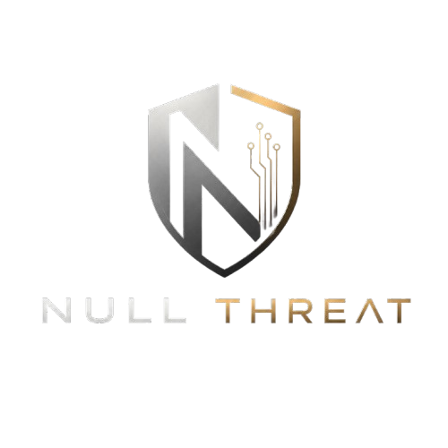

<p align="center">
  
</p>

<h1 align="center">Null Threat</h1>

<p align="center">
  <strong>Scan locally. Trust nothing.</strong>
</p>

<p align="center">
  <a href="https://github.com/givecursorfree-oss/Null-Threat-Desktop/actions"></a>
  <a href="LICENSE"></a>
  <a href="#installation"></a>
  <a href="https://github.com/givecursorfree-oss/Null-Threat-Desktop/releases"></a>
  <a href="https://github.com/givecursorfree-oss/Null-Threat-Desktop/stargazers"></a>
</p>

<p align="center">
  <a href="#features">Features</a> •
  <a href="#screenshots">Screenshots</a> •
  <a href="#installation">Installation</a> •
  <a href="#dependencies">Dependencies</a> •
  <a href="#build-from-source">Build</a> •
  <a href="#signature-updates">Signatures</a> •
  <a href="#contributing">Contributing</a> •
  <a href="#license">License</a>
</p>

---

Null Threat is a free, open-source desktop security scanner built with **Rust (Tauri 2)** and **React + TypeScript**. It analyzes files using four local detection engines — SHA-256 hash lookup, ClamAV, YARA rules, and **multi-stage deep analysis** — entirely on your machine. Deep analysis covers **file identity**, **container structure**, **metadata tags**, and **image steganalysis**. **ClamAV, YARA, ffprobe, ffmpeg, and ExifTool** are bundled in release builds.

**Offline scanning:** every scan runs locally with no cloud upload of files or results. **Optional updates** (MalwareBazaar hashes, ClamAV virus definitions) use the network only when you click update in Settings. Release installers include bundled ClamAV definitions for day-one offline use. No telemetry, no subscriptions. Licensed under **GPL v3**.

> **Edit marketing copy:** See [docs/PRODUCT-COPY.md](docs/PRODUCT-COPY.md) for hero page text, feature bullets, and changelog.

---

## Screenshots

| Dashboard | Active Scan | Scan Result Detail |
|---|---|---|
|  |  |  |

| Quarantine Vault | Scan History | Settings |
|---|---|---|
|  |  |  |

---

## Features

- 🔍 **Four Local Detection Engines** — SHA-256 hash lookup, ClamAV, YARA rules, and deep analysis run on your hardware
- 🔬 **Multi-Stage Deep Analysis** — Expandable breakdown: **Identity** (magic bytes, entropy), **Structure** (MP4/MKV, subtitles, ffprobe), **Metadata** (ExifTool + native), **Steganalysis** (image LSB; video LSB not scored)
- 📦 **All Tools Bundled** — ClamAV, YARA, ffprobe, ffmpeg, and ExifTool ship with the app — no separate installs
- 🗄️ **Hash Intelligence** — MalwareBazaar and NSRL signatures in local SQLite — refresh when online, scan offline
- 🛡️ **ClamAV Integration** — Industry-standard antivirus via bundled `clamscan`
- 📜 **YARA Rule Matching** — ~23 bundled rules: polyglot files, packers, metadata injection, video-container threats
- 👁️ **Real-time Folder Watcher** — Scans files the moment they land in watched directories
- 🔐 **AES-256-GCM Quarantine Vault** — Encrypted isolation with restore and delete
- 📊 **0–100 Risk Score** — Transparent `X/100` scoring with per-engine breakdown (Clean 0–20 · Suspicious 21–50 · High Risk 51–80 · Malware 81–100). Heuristics alone cap at 48 without a signature hit
- 📋 **Scan History** — SQLite log with search, CSV export, and **permanent clear** in Settings
- 🧹 **Data & Privacy Controls** — Export or permanently wipe scan history from Settings (quarantine/whitelist preserved)
- 📡 **Offline Signature Updates** — MalwareBazaar CSV download for air-gapped systems
- 🌙 **Dark-themed UI** — Purpose-built interface with silver/gold brand system

---

## Installation

Download the latest release from [GitHub Releases](https://github.com/givecursorfree-oss/Null-Threat-Desktop/releases). Each release includes `SHA256SUMS.txt` — verify before install (see [SECURITY.md](SECURITY.md)).

> **Unsigned installers:** Community CI builds may show Windows SmartScreen or macOS Gatekeeper warnings until Authenticode / Apple notarization secrets are configured. Verify the checksum, then proceed per [docs/CODE_SIGNING.md](docs/CODE_SIGNING.md#user-facing-warnings).

### Windows

Download the latest `.msi` or `.exe` installer from [Releases](https://github.com/givecursorfree-oss/Null-Threat-Desktop/releases).

```powershell
# Or install dependencies and run from source — see Build from Source below
winget install Rustlang.Rustup
winget install OpenJS.NodeJS.LTS
winget install ClamAV.ClamAV
winget install Gyan.FFmpeg
```

### macOS

Download the latest `.dmg` from [Releases](https://github.com/givecursorfree-oss/Null-Threat-Desktop/releases).

```bash
brew install --cask null-threat
# Or build from source:
brew install rust node clamav ffmpeg
```

### Linux

Download the latest `.AppImage`, `.deb`, or `.rpm` from [Releases](https://github.com/givecursorfree-oss/Null-Threat-Desktop/releases).

```bash
# Debian/Ubuntu (.deb)
sudo dpkg -i null-threat_*.deb

# Fedora/RHEL (.rpm)
sudo rpm -i null-threat-*.rpm

# AppImage
chmod +x NullThreat-*.AppImage && ./NullThreat-*.AppImage
```

---

## Dependencies

Null Threat bundles **ClamAV**, **YARA**, **ffprobe**, **ffmpeg**, and **ExifTool** in release builds (CI downloads them automatically). End users do not install these separately.

For **local development builds**, bundle all scanner tools with one command:

**Windows:**

```powershell
.\scripts\setup-scanner-tools.ps1
```

**Linux / macOS:**

```bash
chmod +x scripts/setup-scanner-tools.sh
./scripts/setup-scanner-tools.sh
```

| Tool | Purpose | Release build |
|---|---|---|
| **ClamAV** | Antivirus signature scanning | Bundled |
| **YARA** | Rule-based file matching | Bundled |
| **ffprobe** | Video container analysis | Bundled |
| **ffmpeg** | Video tooling (frame pipeline) | Bundled |
| **ExifTool** | Metadata tag extraction | Bundled |

Individual setup scripts (`setup-clamav*`, `setup-yara-ffprobe*`) remain available if you only need one tool.

---

## Build from Source

### Prerequisites

| Tool | Version |
|---|---|
| **Rust** | 1.77+ |
| **Node.js** | 20 LTS+ |
| **Scanner tools** | Bundled via `setup-scanner-tools` (see above) |

### Steps

```bash
# 1. Clone the repository
git clone https://github.com/givecursorfree-oss/Null-Threat-Desktop.git
cd Null-Threat-Desktop

# 2. Install frontend dependencies
npm install

# 3. Bundle scanner tools (ClamAV + YARA + ffprobe + ffmpeg + ExifTool)
# Windows: .\scripts\setup-scanner-tools.ps1
# Linux/macOS: ./scripts/setup-scanner-tools.sh

# 4. Run in development mode (hot-reload)
npm run dev

# 5. Build production installer
npm run build
```

Production binaries are output to `src-tauri/target/release/`. Platform installers (`.msi`, `.dmg`, `.deb`, `.AppImage`) are generated in `src-tauri/target/release/bundle/`.

---

## Signature Updates

Null Threat maintains a local SQLite database of malware hash signatures sourced from **MalwareBazaar** and **NSRL**. **Scanning does not need the network.** Updates are optional and user-initiated.

### Automatic Updates (Online)

1. Open **Settings → Signature Updates**.
2. Enable **Download MalwareBazaar CSV automatically**.
3. Choose schedule: Daily, Weekly, or Manual.
4. Click **Update Now** to fetch immediately.

The app downloads the latest MalwareBazaar CSV, parses entries, and upserts them into the local SQLite database. A banner appears if signatures are older than 7 days.

### Manual Import (Air-gapped Systems)

1. Download the MalwareBazaar CSV from a connected machine: [bazaar.abuse.ch/export/csv/](https://bazaar.abuse.ch/export/csv/)
2. Transfer the file via USB or secure channel to the air-gapped machine.
3. Open **Settings → Signature Updates → Import CSV**.
4. Select the CSV file. Null Threat validates and imports entries.

> **Note:** ClamAV virus definitions ship bundled in release builds. Optional online updates refresh definitions when you click **Update signatures** in Settings — not required for offline scanning with the bundled set.

---

## YARA Rules

Custom YARA rules ship in the `rules/` directory and load automatically at startup:

```
rules/
├── video_threats.yar        # PE executables, ZIP archives, PowerShell inside MP4/AVI/MKV
├── polyglot.yar             # Multi-format files (PDF+ZIP, PNG+ZIP, JAR-in-image)
├── suspicious_metadata.yar  # Script injection, C2 URLs, cmd patterns in EXIF/XMP/ID3/OLE
└── packed_executables.yar   # UPX, ASPack, Themida, VMProtect, and other packers
```

### Adding Custom Rules

Place additional `.yar` or `.yara` files in the `rules/` directory. Null Threat loads all rule files recursively at startup. Each rule should include a `meta` section:

```yara
rule example_custom_rule {
    meta:
        description = "Detects example pattern"
        author = "your-name"
        severity = "high"
        created = "2026-06-30"
    strings:
        $s1 = "malicious_string" ascii
    condition:
        $s1
}
```

See [rules/README.md](rules/README.md) for full documentation.

---

## Contributing

Contributions are welcome! Null Threat is GPL v3 open source.

1. Fork the repository
2. Create a feature branch: `git checkout -b feat/your-feature`
3. Commit with clear messages: `git commit -m "feat: add custom YARA rule for XYZ"`
4. Push and open a Pull Request

Please read [CONTRIBUTING.md](CONTRIBUTING.md) for development guidelines, code style, and the pull request process.

---

## Security

If you discover a security vulnerability, **do not open a public issue**.

Email **security@nullthreat.dev** with:
- Description of the vulnerability
- Steps to reproduce
- Potential impact assessment

We respond within 48 hours and coordinate a fix before public disclosure. See [SECURITY.md](SECURITY.md) for our full security policy.

---

## License

Null Threat is licensed under the **GNU General Public License v3.0**.

```
Copyright (C) 2026 Null Threat Contributors

This program is free software: you can redistribute it and/or modify
it under the terms of the GNU General Public License as published by
the Free Software Foundation, either version 3 of the License, or
(at your option) any later version.

This program is distributed in the hope that it will be useful,
but WITHOUT ANY WARRANTY; without even the implied warranty of
MERCHANTABILITY or FITNESS FOR A PARTICULAR PURPOSE. See the
GNU General Public License for more details.
```

See [LICENSE](LICENSE) for the full license text.

> ClamAV is licensed under GPL-2.0. Bundling ClamAV in your distribution requires compliance with the GPL.

---

<p align="center">
  Built with Rust, React, and a healthy paranoia about file integrity.<br />
  <a href="website/index.html">Marketing Site</a> •
  <a href="docs/PRODUCT-COPY.md">Product Copy</a> •
  <a href="docs/brand/BRAND-IDENTITY.md">Brand Guide</a> •
  <a href="docs/design/tokens.css">Design Tokens</a>
</p>
